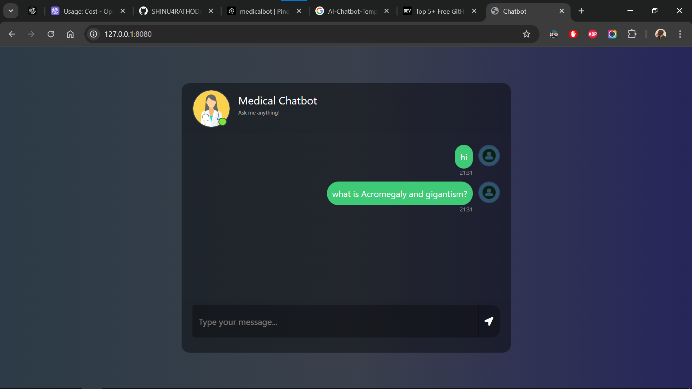

# End-to-end-Medical-Chatbot-Generative-AI
# here is UI Of this application


# Table of Contents
* Overview
* Data Sources
* Technologies
* Features
* Setup
* Usage
* How It Works
* License

## Project Overview
This End-to-End Medical Chatbot provides an interactive platform for users to get medical information and advice on over 1,750 common medical disorders, conditions, tests, and treatments. The chatbot is powered by OpenAI’s LLM (GPT), LangChain, and Pinecone, which work together to provide accurate and user-friendly responses, derived from a trusted medical source—"The Gale Encyclopedia of Medicine (3rd Edition)".

The Gale Encyclopedia of Medicine (GEM3) is a comprehensive, user-friendly reference that covers a wide range of common medical topics, including diseases like AIDS, Alzheimer’s, cancer, and heart disease. It’s written in accessible language to ensure that both healthcare professionals and laypersons can easily understand the content. This project aims to bridge the gap between basic consumer health resources and highly technical professional materials.

## Data Source
The chatbot uses data extracted from The Gale Encyclopedia of Medicine (3rd Edition). GEM3 is a valuable resource that provides medical information on topics such as:
* Common Medical Conditions: Covers over 1,750 disorders, tests, and treatments.
* High-Profile Diseases: Includes detailed information on diseases like AIDS, Alzheimer’s disease, Cancer, and Heart attack.
* Accessible Language: Written in a way that is easy for the general public to understand, avoiding medical jargon while still offering comprehensive coverage.


## Technologies
* OpenAI: Used for large language model (LLM) generation.
* Pinecone: A vector database that stores and retrieves embeddings for efficient query matching.
* LangChain: A framework for building and chaining language models together with data and retrieval components.
* Flask: A micro web framework to expose the chatbot API.
* Python-dotenv: Loads environment variables for secure configuration management.
* Sentence-Transformers: For embedding text and converting medical documents into vectors.
* Pypdf: To extract data from PDF medical documents (if needed).

## Features : 
* Natural Language Interaction: Uses OpenAI GPT to process user queries and generate human-like responses.
* Medical Knowledge: Information is sourced from The Gale Encyclopedia of Medicine (3rd Edition), which provides medical details on over 1,750 conditions, treatments, and diseases.
* Data Extraction: Key medical knowledge is extracted, indexed, and transformed into searchable vectors for integration with Pinecone.
* Embeddings: The medical content is embedded using HuggingFace embeddings, ensuring relevant results for users' queries.
* Easy Integration: The entire system is orchestrated using LangChain, ensuring smooth interaction between components.
* Fast Retrieval: Uses Pinecone to efficiently search and retrieve relevant data based on query embeddings.
* Real-time Conversation: Responds to real-time medical inquiries using OpenAI's GPT model.
* Customizable Data Source: You can add your own medical knowledge base to improve the chatbot’s responses.


# How to run?
### STEPS:

Clone the repository

```bash
git clone [https://github.com/SHINU4RATHOD/medical-chatbot.git
cd medical-chatbot](https://github.com/SHINU4RATHOD/Medical-Chatbot-LLM-Pinecone-LangChain.git)
```
### STEP 01- Create a Python virtual environment and activate it:
```bash
conda create -n medibot python=3.10 -y
```

```bash
conda activate medibot
```


### STEP 02- Install the required dependencies:
```bash
pip install -r requirements.txt
```


### Set up environment variables. Create a .env file in the root directory with the following configurations:

```ini
PINECONE_API_KEY = "xxxxxxxxxxxxxxxxxxxxxxxxxxxxx"
OPENAI_API_KEY = "xxxxxxxxxxxxxxxxxxxxxxxxxxxxx"
```


```bash
# run the following command to store embeddings to pinecone
python store_index.py
```

```bash
# Finally run the following command
python app.py
```

Now,
```bash
open up localhost:
```


## How It Works
* User Query: A user sends a query to the chatbot.
* Embeddings: The query is passed through the OpenAI model to generate embeddings.
* Pinecone Search: The embeddings are used to search through the medical knowledge stored in Pinecone.
* Contextual Response: The top retrieved data is used to generate a response, which is then combined with the OpenAI LLM's output for a conversational answer.
* Response: The chatbot returns a comprehensive and contextually relevant response to the user.

# Future Improvements
1. Expand Database: Adding more medical resources and references to improve response accuracy.
2. Multilingual Support: Adding support for multiple languages to make the chatbot accessible globally.
3. Advanced Features: Integrating voice-based input and more advanced search algorithms.

